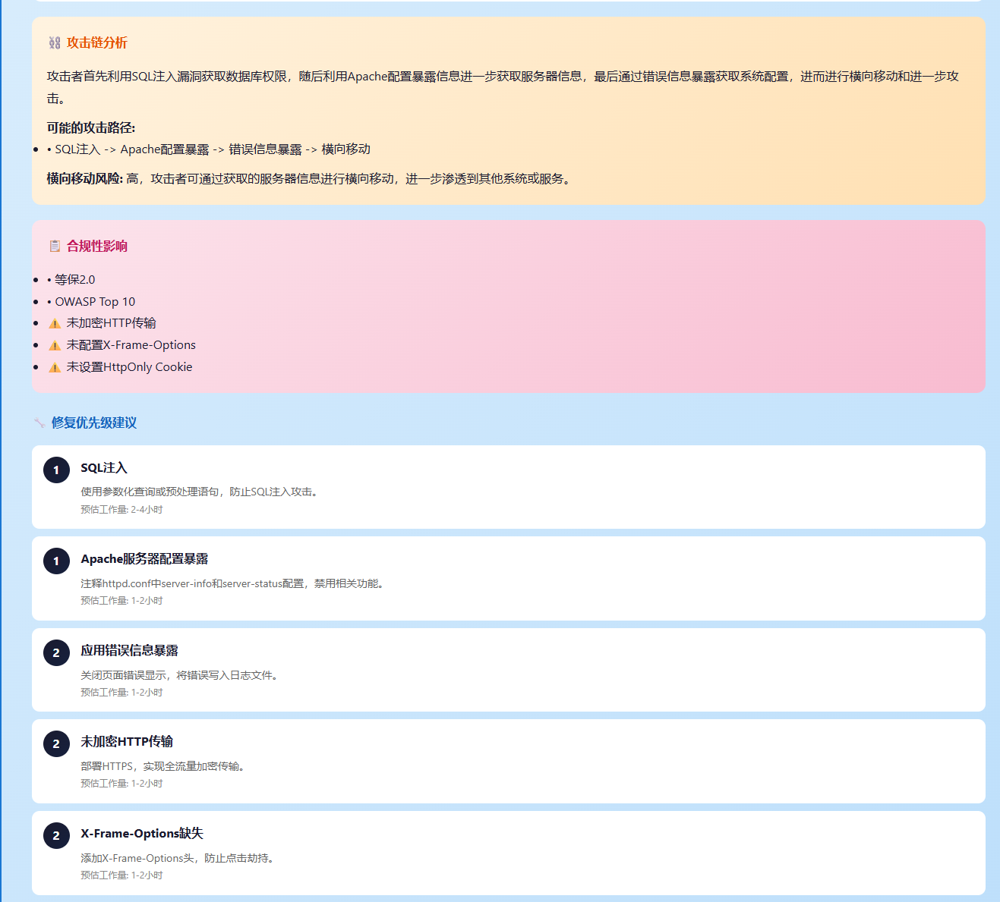
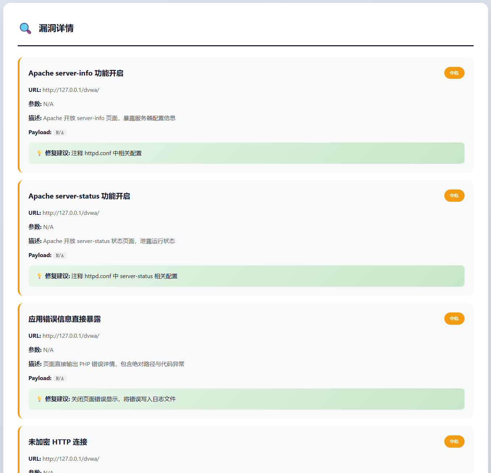

# WebScan AI Security Platform

<div align="center">


**AI驱动的Web应用安全扫描平台**

一个功能强大的Web应用安全扫描平台，集成POC漏洞扫描、端口扫描、AI Agent智能决策等多种安全检测能力

[功能特性](#-功能特性) • [系统架构](#-系统架构) • [快速开始](#-快速开始) • [API文档](#-api文档)

</div>

---

## 目录

- [项目简介](#-项目简介)
- [系统架构](#-系统架构)
- [双系统对比](#-双系统对比)
- [功能特性](#-功能特性)
- [技术栈](#-技术栈)
- [快速开始](#-快速开始)
- [项目结构](#-项目结构)
- [配置说明](#-配置说明)
- [API文档](#-api文档)
- [开发指南](#-开发指南)
- [部署指南](#-部署指南)
- [常见问题](#-常见问题)
- [作者介绍](#-作者介绍)
- [联系方式](#-联系方式)

---

## 📖 项目简介

WebScan AI Security Platform 是一个基于AI技术的Web应用安全扫描平台，旨在帮助开发者和安全专业人员快速发现和修复Web应用中的安全漏洞。

### 核心特点

- **全面的漏洞检测** - 支持POC漏洞扫描、端口扫描、AI Agent等多种扫描方式
- **AI智能分析** - 利用LangGraph和LangChain进行智能漏洞分析和风险评估
- **RAG知识库增强** - 集成LlamaIndex实现专业知识库检索增强
- **可视化报告** - 提供直观的扫描结果和详细的漏洞报告
- **高性能架构** - 基于FastAPI和原生JavaScript构建，提供快速响应和流畅体验
- **易于扩展** - 模块化设计，支持自定义扫描插件和规则
- **实时通信** - WebSocket实时推送扫描进度和结果

---

## 🏗️ 系统架构

本项目采用双系统架构设计，提供两套独立的安全扫描服务：

```
┌─────────────────────────────────────────────────────────────────────────────┐
│                           WebScan AI Security Platform                       │
├─────────────────────────────────────────────────────────────────────────────┤
│                                                                              │
│  ┌─────────────────────────────────┐    ┌─────────────────────────────────┐ │
│  │       TOSKill System            │    │       Backend System            │ │
│  │       (轻量级独立服务)            │    │       (企业级完整服务)           │ │
│  │                                 │    │                                 │ │
│  │  ┌───────────────────────────┐  │    │  ┌───────────────────────────┐  │ │
│  │  │   LangGraph Agent Core    │  │    │  │   Multi-Agent System      │  │ │
│  │  │   - ReACT推理框架          │  │    │  │   - 任务规划Agent          │  │ │
│  │  │   - 状态机工作流           │  │    │  │   - 漏洞扫描Agent          │  │ │
│  │  │   - 用户交互中断           │  │    │  │   - 报告生成Agent          │  │ │
│  │  └───────────────────────────┘  │    │  └───────────────────────────┘  │ │
│  │                                 │    │                                 │ │
│  │  ┌───────────────────────────┐  │    │  ┌───────────────────────────┐  │ │
│  │  │   RAG Knowledge Base      │  │    │  │   Vulnerability Plugins   │  │ │
│  │  │   - LlamaIndex检索        │  │    │  │   - SQL注入/XSS/CSRF      │  │ │
│  │  │   - 向量存储              │  │    │  │   - 文件上传/SSRF/LFI     │  │ │
│  │  │   - 知识文档库            │  │    │  │   - 命令注入/弱口令       │  │ │
│  │  └───────────────────────────┘  │    │  └───────────────────────────┘  │ │
│  │                                 │    │                                 │ │
│  │  ┌───────────────────────────┐  │    │  ┌───────────────────────────┐  │ │
│  │  │   Scan Tools              │  │    │  │   POC System              │  │ │
│  │  │   - 信息收集              │  │    │  │   - Struts2/ThinkPHP      │  │ │
│  │  │   - 漏洞扫描              │  │    │  │   - Weblogic/Tomcat       │  │ │
│  │  │   - POC验证               │  │    │  │   - Drupal/Nexus          │  │ │
│  │  └───────────────────────────┘  │    │  └───────────────────────────┘  │ │
│  │                                 │    │                                 │ │
│  │  Port: 8081                    │    │  Port: 8888                     │ │
│  └─────────────────────────────────┘    └─────────────────────────────────┘ │
│                                                                              │
│  ┌───────────────────────────────────────────────────────────────────────┐  │
│  │                          Frontend Applications                         │  │
│  │                                                                        │  │
│  │  ┌─────────────────────┐    ┌─────────────────────┐                   │  │
│  │  │   toskill-frontend  │    │      front (Vue3)   │                   │  │
│  │  │   (原生JavaScript)   │    │   (Element Plus)    │                   │  │
│  │  │   轻量级/快速部署    │    │   企业级/功能丰富    │                   │  │
│  │  └─────────────────────┘    └─────────────────────┘                   │  │
│  └───────────────────────────────────────────────────────────────────────┘  │
│                                                                              │
└─────────────────────────────────────────────────────────────────────────────┘
```

---

## 🔄 双系统对比

本项目包含两套独立的安全扫描系统，可根据需求选择使用：

### TOSKill System (推荐)

| 特性 | 说明 |
|------|------|
| **定位** | 轻量级、独立的AI驱动安全扫描服务 |
| **端口** | 8081 |
| **架构** | 单服务架构，部署简单 |
| **AI引擎** | LangGraph ReACT框架 |
| **知识库** | RAG (LlamaIndex) |
| **前端** | 原生JavaScript，轻量高效 |
| **适用场景** | 快速部署、个人安全测试、学习研究 |

**TOSKill核心优势：**
- ✅ 基于LangGraph的智能决策引擎
- ✅ RAG知识库增强的漏洞分析
- ✅ 用户交互式中断/恢复机制
- ✅ 认证信息自动提取与复用
- ✅ AI脚本生成与安全审查
- ✅ 简化的单服务部署架构

### Backend System

| 特性 | 说明 |
|------|------|
| **定位** | 企业级、功能完整的安全扫描平台 |
| **端口** | 8888 |
| **架构** | 多模块架构，功能丰富 |
| **AI引擎** | Multi-Agent协作系统 |
| **插件系统** | 可扩展的漏洞扫描插件 |
| **前端** | Vue3 + Element Plus |
| **适用场景** | 企业安全审计、团队协作、大规模扫描 |

**Backend核心优势：**
- ✅ 多Agent协作的任务规划系统
- ✅ 完整的漏洞扫描插件生态
- ✅ 丰富的POC验证库
- ✅ 企业级报告生成系统
- ✅ AWVS集成支持
- ✅ Seebug POC平台对接

### 功能对比表

| 功能模块 | TOSKill | Backend |
|---------|:-------:|:-------:|
| 端口扫描 | ✅ | ✅ |
| 子域名枚举 | ✅ | ✅ |
| CMS识别 | ✅ | ✅ |
| WAF检测 | ✅ | ✅ |
| SQL注入扫描 | ✅ | ✅ |
| XSS扫描 | ✅ | ✅ |
| CSRF扫描 | ✅ | ✅ |
| 文件上传漏洞 | ✅ | ✅ |
| SSRF扫描 | ✅ | ✅ |
| LFI扫描 | ✅ | ✅ |
| 命令注入 | ✅ | ✅ |
| POC验证 | ✅ | ✅ |
| AI智能决策 | ✅ LangGraph | ✅ Multi-Agent |
| RAG知识库 | ✅ | ❌ |
| 用户交互中断 | ✅ | ❌ |
| 认证信息提取 | ✅ | ❌ |
| AI脚本生成 | ✅ | ❌ |
| AWVS集成 | ❌ | ✅ |
| Seebug对接 | ❌ | ✅ |
| 多格式报告 | ✅ | ✅ |
| WebSocket实时 | ✅ | ✅ |

---

## ⚡ 功能特性

### 核心功能

| 功能模块 | 描述 | 状态 |
|---------|------|:----:|
| **信息收集** | 端口扫描、子域名枚举、CMS识别、WAF检测、CDN检测等 | ✅ |
| **漏洞扫描** | SQL注入、XSS、命令注入、文件上传、SSRF、CSRF、LFI等 | ✅ |
| **POC验证** | Struts2、ThinkPHP、Weblogic、Tomcat、Drupal等框架漏洞POC | ✅ |
| **AI Agent扫描** | 基于LangGraph/Multi-Agent的智能代理自动化扫描 | ✅ |
| **RAG知识库** | LlamaIndex驱动的专业知识检索增强（TOSKill） | ✅ |
| **AI对话** | 智能安全咨询和漏洞分析 | ✅ |
| **脚本管理** | 自定义脚本上传、AI脚本生成、安全审查 | ✅ |
| **扫描报告** | HTML/JSON/Markdown/PDF多格式报告生成 | ✅ |
| **实时监控** | WebSocket实时推送扫描进度和结果 | ✅ |

### 高级特性

- **ReACT推理决策** - AI使用Thought-Action-Reason模式进行智能决策
- **用户交互中断** - 工作流支持暂停等待用户确认（TOSKill）
- **认证信息管理** - 自动提取、加密存储、复用认证信息
- **智能工具选择** - 根据端口扫描结果推荐合适的扫描工具
- **脚本安全审查** - 上传和生成的脚本自动进行安全检查
- **会话状态管理** - 支持TTL过期清理、版本控制、状态恢复
- **CVSS评分** - 自动估算漏洞CVSS评分和风险等级
- **漏洞去重** - 基于类型+URL+参数的智能去重

---

## 📸 项目展示

### 系统截图

#### AI交互式扫描

<div align="center">
AI交互式扫描


*基于LangGraph的AI智能交互式扫描决策过程*

#### 端口扫描


#### 任务选择

*扫描任务选择与配置*


#### 脚本管理


*自定义脚本上传与管理*


#### 报告管理

*扫描报告管理与导出*

#### 扫描报告






*多格式扫描报告生成*

#### 教学漏洞扫描结果

*教学环境下的漏洞扫描结果展示*

#### DAWA靶场教学平台


*DAWA靶场教学平台集成*

#### 教学系统主界面


*WebScan AI Security Platform 教学系统主界面*

</div>

### 🎥 项目演示视频

<div align="center">

<video width="100%" controls>
  <source src="./demo_project_presentation/videos/"AI for Security"具备自主决策能力的Web安全漏洞扫描智能体系统.mp4" type="video/mp4">
  您的浏览器不支持视频播放。
</video>
**"AI for Security" - 具备自主决策能力的Web安全漏洞扫描智能体系统**

*完整演示视频展示了系统的核心功能、AI决策过程、漏洞扫描流程等*

**如果视频无法播放，请[点击这里下载观看](./demo_project_presentation/videos/"AI%20for%20Security"具备自主决策能力的Web安全漏洞扫描智能体系统.mp4)**

</div>

---

## 🛠️ 技术栈

### TOSKill System

```yaml
核心框架:
  - FastAPI: 0.115+           # 现代化Python Web框架
  - Uvicorn: 0.34+            # ASGI服务器
  - Pydantic: 2.10+           # 数据验证和序列化

AI框架:
  - LangChain: 0.3+           # AI应用框架
  - LangGraph: 0.2+           # AI工作流框架（StateGraph + interrupt）
  - OpenAI: 1.59+             # OpenAI API客户端

RAG知识库:
  - LlamaIndex: 最新版        # RAG检索增强生成框架

安全扫描:
  - Nmap: 0.7+                # 端口扫描
  - BeautifulSoup4: 4.12+     # HTML解析
  - Requests: 2.32+           # HTTP请求
```

### Backend System

```yaml
核心框架:
  - FastAPI: 0.115+           # 现代化Python Web框架
  - Tortoise-ORM: 最新版      # 异步ORM
  - Aerich: 最新版            # 数据库迁移

AI框架:
  - LangChain: 0.3+           # AI应用框架
  - OpenAI: 1.59+             # OpenAI API客户端

安全扫描:
  - Pocsuite3: 最新版         # POC框架

集成支持:
  - AWVS API: 完整支持        # 漏洞扫描集成
  - Seebug API: 完整支持      # POC平台对接
```

### 前端技术栈

| 项目 | 技术栈 | 特点 |
|------|--------|------|
| toskill-frontend | 原生JavaScript + CSS3 | 轻量级、无依赖、快速加载 |
| front | Vue3 + Element Plus + Vite | 企业级、组件丰富、开发效率高 |

---

## 🚀 快速开始

### 环境要求

- Python 3.8 或更高版本
- 现代浏览器（Chrome、Firefox、Edge等）
- （可选）Node.js 18+ 用于Vue前端开发

### 方式一：TOSKill System（推荐新手）

#### 1. 克隆项目

```bash
git clone https://github.com/yourusername/webscan-ai.git
cd webscan-ai
```

#### 2. 后端安装与启动

```bash
# 进入TOSKill目录
cd TOSKill

# 创建虚拟环境（推荐）
python -m venv venv

# 激活虚拟环境
# Windows:
venv\Scripts\activate
# Linux/Mac:
source venv/bin/activate

# 安装依赖
pip install -r requirements.txt

# 配置环境变量（可选）
# 创建 .env 文件并配置 OPENAI_API_KEY

# 启动服务
python main.py
```

后端服务将运行在：http://localhost:8081

#### 3. 访问前端

TOSKill前端由后端直接提供静态文件服务：

- **前端页面**: http://localhost:8081/frontend
- **API文档**: http://localhost:8081/docs
- **ReDoc**: http://localhost:8081/redoc

### 方式二：Backend System（企业级）

#### 1. 后端安装与启动

```bash
# 进入backend目录
cd backend

# 创建虚拟环境
python -m venv venv
venv\Scripts\activate  # Windows

# 安装依赖
pip install -r requirements.txt

# 配置数据库（SQLite默认可用）
# 或修改 config.py 配置MySQL/PostgreSQL

# 启动服务
python main.py
```

后端服务将运行在：http://localhost:8888

#### 2. Vue前端安装与启动

```bash
# 进入前端目录
cd front

# 安装依赖
npm install

# 开发模式启动
npm run dev

# 或构建生产版本
npm run build
```

前端开发服务器：http://localhost:5173

### 方式三：双系统并行运行

```bash
# 终端1: 启动TOSKill
cd TOSKill && python main.py

# 终端2: 启动Backend
cd backend && python main.py

# 终端3: 启动Vue前端（可选）
cd front && npm run dev
```

---

## 📁 项目结构

```
AI_WebSecurity/
├── TOSKill/                          # TOSKill系统（推荐）
│   ├── AI/                           # AI核心模块
│   │   ├── core.py                   # 核心业务逻辑
│   │   ├── graph.py                  # LangGraph工作流定义
│   │   ├── state.py                  # 状态机定义
│   │   ├── tools.py                  # 工具函数
│   │   ├── validators.py             # 输入验证器
│   │   ├── script_safety.py          # 脚本安全审查
│   │   └── llm_client.py             # LLM客户端
│   │
│   ├── RAG/                          # RAG知识库模块
│   │   ├── rag_engine.py             # RAG引擎
│   │   ├── retriever.py              # 检索器
│   │   ├── knowledge/                # 知识文档（14个专业文档）
│   │   └── storage/                  # 向量存储
│   │
│   ├── api/                          # API路由
│   │   ├── ai_chat_websocket.py      # AI对话WebSocket
│   │   ├── scan_api.py               # 扫描API
│   │   └── report.py                 # 报告API
│   │
│   ├── tools/                        # 扫描工具
│   │   ├── info_collection/          # 信息收集工具
│   │   │   ├── portscan.py           # 端口扫描
│   │   │   ├── subdomain.py          # 子域名扫描
│   │   │   ├── waf.py                # WAF检测
│   │   │   ├── whatcms.py            # CMS识别
│   │   │   └── ...
│   │   │
│   │   ├── vuln_scan/                # 漏洞扫描工具
│   │   │   ├── sqli.py               # SQL注入
│   │   │   ├── xss.py                # XSS扫描
│   │   │   ├── cmdi.py               # 命令注入
│   │   │   └── ...
│   │   │
│   │   ├── poc/                      # POC验证
│   │   │   ├── struts2.py
│   │   │   ├── thinkphp.py
│   │   │   └── weblogic.py
│   │   │
│   │   └── report/                   # 报告生成
│   │       ├── report_manager.py     # 报告管理器
│   │       ├── ai_analyzer.py        # AI分析器
│   │       ├── vuln_analyzer.py      # 漏洞分析器
│   │       └── html_report_generator.py
│   │
│   ├── tests/                        # 测试文件
│   ├── main.py                       # 应用入口
│   ├── config.py                     # 配置管理
│   └── requirements.txt              # 依赖列表
│
├── toskill-frontend/                 # TOSKill前端
│   ├── index.html                    # 主页面
│   ├── src/
│   │   ├── components/               # Vue组件
│   │   │   ├── views/                # 页面视图
│   │   │   │   ├── ScanView.vue      # 扫描页面
│   │   │   │   ├── ReportsView.vue   # 报告页面
│   │   │   │   ├── ToolsView.vue     # 工具页面
│   │   │   │   └── SettingsView.vue  # 设置页面
│   │   │   └── ...
│   │   ├── services/                 # 服务层
│   │   │   ├── api.js                # API封装
│   │   │   └── websocket.js          # WebSocket管理
│   │   └── ...
│   └── package.json
│
├── backend/                          # Backend系统
│   ├── ai_agents/                    # AI代理系统
│   │   ├── core/                     # 核心模块
│   │   │   ├── graph.py              # Agent工作流图
│   │   │   ├── nodes.py              # 节点定义
│   │   │   └── state.py              # 状态定义
│   │   │
│   │   ├── analyzers/                # 分析器
│   │   │   ├── ai_analyzer.py        # AI分析器
│   │   │   ├── enhanced_report_gen.py
│   │   │   └── vuln_analyzer.py
│   │   │
│   │   ├── poc_system/               # POC系统
│   │   │   ├── poc_manager.py        # POC管理器
│   │   │   ├── verification_engine.py
│   │   │   └── matching/             # POC匹配
│   │   │
│   │   └── tools/                    # Agent工具
│   │       ├── registry.py           # 工具注册
│   │       ├── wrappers.py           # 工具包装器
│   │       └── adapters.py           # 适配器
│   │
│   ├── api/                          # API路由
│   │   ├── ai.py                     # AI对话API
│   │   ├── tasks.py                  # 任务API
│   │   ├── reports.py                # 报告API
│   │   ├── poc.py                    # POC API
│   │   ├── seebug.py                 # Seebug API
│   │   ├── awvs.py                   # AWVS API
│   │   └── websocket.py              # WebSocket
│   │
│   ├── vulnerability_scan_plugins/   # 漏洞扫描插件
│   │   ├── sqli/                     # SQL注入
│   │   ├── xss/                      # XSS扫描
│   │   ├── csrf/                     # CSRF扫描
│   │   ├── fileupload/               # 文件上传
│   │   ├── ssrf/                     # SSRF扫描
│   │   ├── lfi/                      # 本地文件包含
│   │   ├── cmdi/                     # 命令注入
│   │   └── infoleak/                 # 信息泄露
│   │
│   ├── poc/                          # POC库
│   │   ├── struts2/                  # Struts2 POC
│   │   ├── thinkphp/                 # ThinkPHP POC
│   │   ├── weblogic/                 # Weblogic POC
│   │   ├── tomcat/                   # Tomcat POC
│   │   └── ...
│   │
│   ├── services/                     # 业务服务
│   │   ├── report_service.py         # 报告服务
│   │   └── notification_service.py   # 通知服务
│   │
│   ├── tests/                        # 测试文件
│   ├── main.py                       # 应用入口
│   ├── config.py                     # 配置管理
│   └── requirements.txt              # 依赖列表
│
├── front/                            # Vue前端
│   ├── src/
│   │   ├── components/               # 组件
│   │   │   ├── business/             # 业务组件
│   │   │   ├── common/               # 通用组件
│   │   │   └── layout/               # 布局组件
│   │   │
│   │   ├── views/                    # 页面
│   │   │   ├── Dashboard.vue         # 仪表盘
│   │   │   ├── AgentScan.vue         # Agent扫描
│   │   │   ├── POCScan.vue           # POC扫描
│   │   │   ├── Reports.vue           # 报告管理
│   │   │   └── ...
│   │   │
│   │   ├── store/                    # 状态管理
│   │   ├── utils/                    # 工具函数
│   │   └── styles/                   # 样式文件
│   │
│   └── package.json
│
├── Seebug_Agent/                     # Seebug Agent模块
│   ├── client.py                     # Seebug客户端
│   ├── generator.py                  # POC生成器
│   └── README.md
│
├── demo_presentation_report/         # 演示报告
├── tests/                            # 集成测试
└── README.md                         # 项目文档
```

---

## ⚙️ 配置说明

### TOSKill配置

配置文件：`TOSKill/config.py`

```python
class TOSKillSettings(BaseSettings):
    # 应用配置
    APP_NAME: str = "TOSKill Security Scanner"
    HOST: str = "127.0.0.1"
    PORT: int = 8081
    
    # AI配置（必填）
    OPENAI_API_KEY: str = ""           # 从环境变量获取
    OPENAI_BASE_URL: str = "https://api.openai.com/v1"
    MODEL_ID: str = "gpt-4"
    
    # 扫描配置
    SCAN_TIMEOUT: int = 300
    MAX_CONCURRENT_SCANS: int = 5
```

### Backend配置

配置文件：`backend/config.py`

```python
class Settings(BaseSettings):
    # 应用配置
    APP_NAME: str = "WebScan Backend"
    HOST: str = "127.0.0.1"
    PORT: int = 8888
    
    # 数据库配置
    DATABASE_URL: str = "sqlite://db.sqlite3"
    
    # AI配置
    OPENAI_API_KEY: str = None
    
    # AWVS配置（可选）
    AWVS_URL: str = ""
    AWVS_API_KEY: str = ""
```

### 环境变量

创建 `.env` 文件：

```env
# AI配置（必填）
OPENAI_API_KEY=your_api_key_here
OPENAI_BASE_URL=https://api.openai.com/v1

# 应用配置
DEBUG=False
LOG_LEVEL=INFO
```

---

## 📚 API文档

### TOSKill API (端口 8081)

启动后访问：
- **Swagger UI**: http://localhost:8081/docs
- **ReDoc**: http://localhost:8081/redoc

### Backend API (端口 8888)

启动后访问：
- **Swagger UI**: http://localhost:8888/docs
- **ReDoc**: http://localhost:8888/redoc

### 主要API端点

#### 扫描任务

```http
# TOSKill WebSocket扫描
WebSocket /api/ai-chat/ws

# Backend REST API
POST /api/tasks/              # 创建扫描任务
GET  /api/tasks/{id}          # 获取任务详情
DELETE /api/tasks/{id}        # 删除任务
```

#### 报告管理

```http
GET  /api/reports/            # 获取报告列表
POST /api/reports/            # 创建报告
GET  /api/reports/{id}        # 获取报告详情
GET  /api/reports/{id}/export # 导出报告
```

#### POC管理

```http
GET  /api/poc/list            # 获取POC列表
POST /api/poc/execute         # 执行POC
```

---

## 🔧 开发指南

### 添加新的扫描工具

```python
# TOSKill: 在 TOSKill/tools/ 下创建
from langchain_core.tools import tool

@tool
def my_scanner(target: str) -> dict:
    """新扫描工具描述"""
    return {"vulnerable": False, "data": {}}

# Backend: 在 backend/vulnerability_scan_plugins/ 下创建
from .base import BaseScanner

class MyScanner(BaseScanner):
    async def scan(self, target: str) -> dict:
        return {"vulnerable": False}
```

### 扩展AI工作流

```python
# TOSKill: 在 TOSKill/AI/graph.py 中添加节点
def my_custom_node(state: AgentState) -> AgentState:
    # 自定义逻辑
    return state

# 添加到工作流图
graph.add_node("my_node", my_custom_node)
```

### 运行测试

```bash
# TOSKill测试
cd TOSKill && pytest tests/ -v

# Backend测试
cd backend && pytest tests/ -v
```

---

## 🐳 部署指南

### Docker部署

```dockerfile
# TOSKill Dockerfile
FROM python:3.9-slim
WORKDIR /app
COPY TOSKill/requirements.txt .
RUN pip install --no-cache-dir -r requirements.txt
COPY TOSKill/ .
CMD ["python", "main.py"]
```

```bash
# 构建并运行
docker build -t toskill .
docker run -p 8081:8081 -e OPENAI_API_KEY=your_key toskill
```

### Nginx反向代理

```nginx
server {
    listen 80;
    server_name your-domain.com;

    location / {
        proxy_pass http://127.0.0.1:8081;
        proxy_set_header Host $host;
        proxy_set_header X-Real-IP $remote_addr;
        
        # WebSocket支持
        proxy_http_version 1.1;
        proxy_set_header Upgrade $http_upgrade;
        proxy_set_header Connection "upgrade";
    }
}
```

---

## ❓ 常见问题

### 1. 后端服务启动失败

**问题**: 端口被占用

**解决方案**:
```bash
# Windows
netstat -ano | findstr :8081

# Linux/Mac
lsof -i :8081
```

### 2. AI模型连接失败

**问题**: AI决策功能不可用

**解决方案**:
- 检查 `OPENAI_API_KEY` 环境变量是否设置
- 确认 `OPENAI_BASE_URL` 可访问
- 查看日志中的错误信息

### 3. WebSocket连接失败

**问题**: 前端无法建立WebSocket连接

**解决方案**:
- 检查后端服务是否正常运行
- 确认WebSocket URL配置正确
- 检查防火墙/Nginx配置

---

## 👨‍💻 作者介绍

<div align="center">

### 关于作者

**fanyibin| Python开发工程师 · 正在寻找工作机会**

**🎓 基础信息**

- 出生年月：2005年
- 学历：本科 网络工程专业（2023.09-2027.06在读）
- 联系方式： 📧 fybfyb0801@qq.com

**🏆 学业与荣誉**

- **专业综合成绩排名第一**，GPA 3.4/4.0
- 航天类专项奖学金

**💼 求职意向**

- **期望岗位**：Python开发工程师 / AI安全研究员 / 全栈开发工程师
- **工作地点**：不限（可接受远程/出差）
- **到岗时间**：可协商（支持实习/全职）

**🏢 实习经历**

- **Python开发工程师（实习）**
  - 参与智测平台全栈研发，负责Python后端与自动化流程开发
  - 搭建文档自动化流水线，集成大模型生成智能测试内容
  - 设计Prompt规则，搭建文档智能审核引擎，审核效率达10条/秒
  - 基于向量数据库+大模型，生成标准化合规测试内容
  - 用Flask+PyQt5搭建授权系统，实现RSA+AES双重加密权限认证

**🚀 核心项目经历**

**1. AI安全智能体平台（WebScan）| 全栈开发**
- 技术栈：Python、FastAPI、LangGraph、ReACT、LlamaIndex、Vue3
- 实现动态漏洞扫描+静态白盒代码审计，支持AST解析、代码比对
- 构建ReACT多轮推理、COT思维链、记忆化会话管理
- 设计10节点状态机工作流，完成全流程AI安全检测
- 开发37个安全工具，覆盖端口扫描、SQL/XSS/CSRF/SSRF等检测与CVE验证

**2. 飞桨OCR Agent综测计算助手 | 全栈开发**
- 技术栈：Django、Vue3、PaddleOCR、Chroma、RAG
- 实现证书自动识别、成绩预测、可视化分析
- 开发RAG智能检索与Agent交互模块，封装为自定义技能包

**3. 线性规划种植优化 | 编程负责人**
- 全国大学生数学建模竞赛**省级一等奖**
- 完成数据清洗、可视化、线性规划/遗传算法等模型落地

**🏅 获奖与证书**

- **国家级**：计算机应用能力与信息素养大赛一等奖
- **省级**：数学建模一等奖、计算机大赛赛区二等奖、创新方法大赛三等奖、大创省级结项
- **校级**：挑战杯二等奖、大创校级结项
- **语言**：CET-4、CET-6
- **软著**：2项软件著作权

**💪 专业能力**

1. **全栈开发**：熟练掌握Python/C；熟练FastAPI/Flask/Django；熟悉Vue3/PyQt5前后端开发
2. **AI工程**：掌握Prompt、RAG/GraphRAG、LangChain/LangGraph、ReACT、LlamaIndex
3. **并发与部署**：asyncio异步、多线程/多进程、PyInstaller、Docker、Linux运维
4. **数据与安全**：MySQL/SQLServer等数据库、ORM开发；RSA/AES加密、安全工具开发
5. **文档处理**：python-docx、openpyxl处理Office文档
6. **系统运维**：CentOS/Ubuntu操作、磁盘分区、Samba/SSH服务部署

**🎯 校园经历**

- **网络工程创新俱乐部 负责人**
  - 主导技术培训、项目开发，指导低年级成员
  - 成果：大创省级立项1项、计算机设计大赛省级奖2项、软著2项

</div>

---

## 📬 联系方式

<div align="center">

欢迎交流学习，共同探讨AI与网络安全的结合！

| 联系方式 | 信息 |
|:-------:|:----:|
| 👤 **姓名** | fanyibin |
| 📧 **邮箱** | fybfyb0801@qq.com |
| 💬 **微信** | fyb15227908455 |
| 🐙 **GitHub** | 欢迎Star和Fork本项目 |

**如果您对这个项目感兴趣，或者想讨论AI安全相关话题，欢迎随时联系！**

**正在寻找Python开发工程师、AI安全研究员、全栈开发工程师等岗位的工作机会，期待与您交流！**

</div>

---

## 📄 许可证

本项目采用 MIT 许可证。详见 [LICENSE](LICENSE) 文件。

---

## 🤝 贡献指南

我们欢迎任何形式的贡献！

### 贡献流程

1. Fork 本仓库
2. 创建特性分支 (`git checkout -b feature/AmazingFeature`)
3. 提交更改 (`git commit -m 'Add some AmazingFeature'`)
4. 推送到分支 (`git push origin feature/AmazingFeature`)
5. 开启 Pull Request

### 代码规范

- 遵循 PEP 8 代码风格（Python）
- 遵循 JavaScript Standard Style（JavaScript）
- 添加详细的文档字符串和注释
- 使用有意义的变量和函数名

---

## 🙏 致谢

感谢以下开源项目：

- [FastAPI](https://fastapi.tiangolo.com/) - 现代化的Python Web框架
- [LangChain](https://langchain.com/) - AI应用开发框架
- [LangGraph](https://langchain-ai.github.io/langgraph/) - AI工作流框架
- [LlamaIndex](https://www.llamaindex.ai/) - RAG框架
- [Vue.js](https://vuejs.org/) - 渐进式JavaScript框架

---

<div align="center">

**如果这个项目对您有帮助，请给我们一个 ⭐️**

Made with ❤️ by a passionate student exploring AI for Security

</div>
